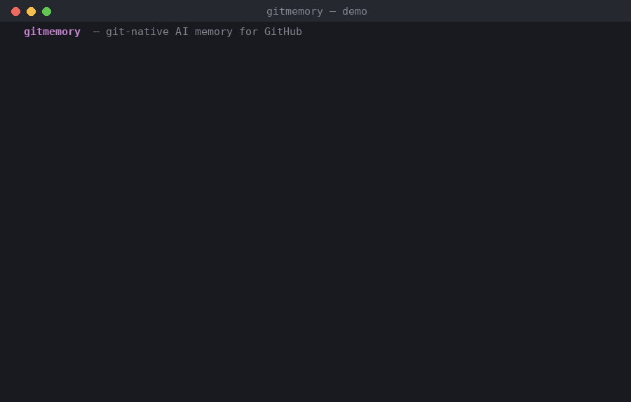

# gitmemory — git-native AI memory for GitHub

> An agent that remembers *why* your repo is the way it is — and forgets what's no longer true.

`gitmemory` distills durable **memories** (decisions, gotchas, conventions, dead-ends)
from your pull requests and issues, **recalls** the relevant ones when new work opens,
and manages a **retraction / supersede lifecycle** so stale knowledge never resurfaces.

It runs entirely on a **local model via [LM Studio](https://lmstudio.ai/)** (OpenAI-compatible
API) — no data leaves your machine, and there are **zero third-party runtime dependencies**.

## Demo



*A real run against `google/gemma-4-e4b` in LM Studio: history is ingested, a new PR
recalls the relevant past decision, the PR reverses it, and the stale memory is
**superseded** so it never surfaces again.*

Reproduce it yourself:

```bash
python sample/live_demo.py           # live, against LM Studio
python sample/live_demo.py --fake    # offline, no model needed
```

Or run the full **usability simulation** on a real local git repo (real commits,
real merge-driver merge, git-native audit trail):

```bash
python simulation/simulate.py        # see simulation/README.md
```

### Live on GitHub

gitmemory has also been run against a **real GitHub repository**, posting real recall
and supersede comments via the API (recall computed locally on `gemma-4-e4b`):

- **Recall** caught a proposed change that contradicted a past decision (surfaced at
  0.83 relevance).
- After a reversal, gitmemory **superseded** the old memory and the follow-up comment
  reflected the new decision (0.87) — the stale one no longer appeared.

<!-- Add a screenshot at docs/live-demo.png (screenshot of the demo issue) and it will render below -->
<!--  -->

Run it on your own repo with `python simulation/github_live_demo.py --repo <owner>/<repo>`
(see [simulation/README.md](simulation/README.md) and `simulation/TOKEN_SETUP.txt`).

---

## Why this is different

Most "AI for GitHub" tools do retrieval-augmented generation over your *current* code.
They have no notion of knowledge going stale, so old decisions keep getting surfaced
long after they were reversed. `gitmemory` treats memory as a first-class, versioned
asset with an explicit lifecycle:

```
active  ──supersede──▶  superseded        (a newer decision replaced it)
   │
   └────retract──────▶  retracted         (proven wrong / no longer true)
```

Only **active** memories are ever surfaced on recall — that's the mechanism that keeps
the system from poisoning new work with outdated context.

> **New here?** Read [**docs/HOW_IT_WORKS.md**](docs/HOW_IT_WORKS.md) for a plain-English
> walkthrough with real examples.

---

## Architecture

```
                    ┌─────────────────────────────────────────────┐
   PR / issue  ───▶ │  ingest agent   distill → embed → store       │
   (on merge)       └─────────────────────────────────────────────┘
                                        │
                                        ▼
                    ┌─────────────────────────────────────────────┐
                    │  retract agent  detect conflicts →           │
                    │                 supersede / retract          │
                    └─────────────────────────────────────────────┘
                                        │
        .gitmemory/memories.json  ◀─────┘   (git-native, versioned, reviewable)
                                        │
                                        ▼
                    ┌─────────────────────────────────────────────┐
   new PR/issue ──▶ │  recall agent   embed query → cosine search  │
   (on open)        │                 (active-only) → PR comment    │
                    └─────────────────────────────────────────────┘
```

| Module | Responsibility |
| --- | --- |
| `models.py` | `MemoryRecord` + `MemoryType` + `MemoryStatus` lifecycle |
| `llm.py` | mockable `LLMClient` interface, `LMStudioClient` (stdlib only), `FakeLLM` |
| `store.py` | git-native JSON store + cosine recall (active-only) |
| `ingest.py` | distill durable memories from PR/issue text, embed, store |
| `recall.py` | retrieve relevant active memories, format the surfacing comment |
| `retract.py` | detect conflicts, propose + apply supersede/retract transitions |
| `cli.py` | `init` / `ingest` / `recall` / `reconcile` / `stats` |
| `action.yml` | composite GitHub Action |

Memories are stored **inside the repo** at `.gitmemory/memories.json`, so every change
(add / supersede / retract) is a normal git diff — fully auditable and reversible.

---

## Quick start (offline, no model needed)

Everything runs offline with the deterministic `FakeLLM` for tests and demos:

```bash
git clone <this-repo> && cd git-ai-memory

# End-to-end demo: ingest history, recall, then supersede a stale decision
python sample/demo.py

# Evaluation harness
python eval/run_eval.py --fake

# Tests
python -m pytest -q
```

---

## Running on a local model (LM Studio)

1. Install **[LM Studio](https://lmstudio.ai/)**.
2. Start the server and load a chat + embedding model (CLI or GUI):
   ```bash
   lms server start                     # serves http://localhost:1234/v1
   lms load google/gemma-4-e4b          # a chat model (verified with this one)
   # also load an embedding model, e.g. text-embedding-nomic-embed-text-v1.5
   ```
3. Point `gitmemory` at it:

```bash
export LMSTUDIO_BASE_URL="http://localhost:1234/v1"
export LMSTUDIO_CHAT_MODEL="google/gemma-4-e4b"
export LMSTUDIO_EMBED_MODEL="text-embedding-nomic-embed-text-v1.5"

pip install .

# Distill memories from a merged PR
gitmemory ingest --source "PR#231" --file merged_pr.md

# Surface relevant memory for new work (prints a Markdown comment)
echo "adding row-level locking to orders" | gitmemory recall

# Inspect the store
gitmemory stats
```

> **Note:** because the model is local, the GitHub Action must run on a
> **self-hosted runner** that has LM Studio running with a model loaded.
> See [`examples/workflows/gitmemory.yml`](examples/workflows/gitmemory.yml).

---

## As a GitHub Action

```yaml
- id: mem
  uses: your-org/gitmemory@v0
  with:
    mode: recall
    content: |
      ${{ github.event.pull_request.title }}
      ${{ github.event.pull_request.body }}
```

- On **new PR/issue** → `mode: recall` posts a comment with related past decisions.
- On **PR merge** → `mode: ingest` distills new memories and reconciles conflicts,
  then opens a PR updating `.gitmemory/memories.json` for human review.

### Guardrails
- Never edits code — only writes memory files and PR/issue comments.
- Supersede/retract transitions are committed via a **PR for human approval**;
  memory is never silently rewritten.
- Scoped token permissions (`contents`, `issues`, `pull-requests`).

### Multiple branches

Memory belongs to the **default branch**; feature branches inherit it and never fork it.
Three mechanisms keep this conflict-free for teams:

1. **Canonical reads** — recall checks out the memory file from `origin/<default_branch>`,
   so even un-rebased branches see current memory.
2. **Serialized writes** — the ingest job uses Actions `concurrency` so memory update PRs
   are queued, never racing (GitHub's server-side merge can't run local merge drivers).
3. **Commutative union merge driver** — for local merges/rebases, run once per clone:
   ```bash
   gitmemory install-merge-driver
   ```
   Merging the memory file then unions records by id (with `retracted > superseded > active`
   precedence), so it never conflicts and never reactivates retired knowledge.

See [docs/HOW_IT_WORKS.md](docs/HOW_IT_WORKS.md#multiple-branches-multiple-people) for details.

---

## Evaluation

The harness (`eval/run_eval.py`) measures the metrics that matter for an agentic
memory system. Run against `--fake` (deterministic pipeline check) or a real LM Studio
model (true quality).

| Metric | What it measures | `--fake` | LM Studio (`gemma-4-e4b`) |
| --- | --- | --- | --- |
| `recall_top1_accuracy` | top-ranked memory is relevant | 0.750 | **1.000** |
| `recall_recall@3` | fraction of relevant memories surfaced | 1.000 | 1.000 |
| `recall_precision@3` | fraction of surfaced memories that are relevant | 0.583 | 0.333* |
| `staleness_rate` | fraction of surfaced memories that are stale (target **0**) | **0.000** | **0.000** |
| `conflict_detection_acc` | correct supersede/retract on labeled pairs | 1.000 | 1.000 |

<sub>*precision@3 is capped at 0.333 here because each golden query has exactly one
relevant memory but we return three — `recall_top1_accuracy` is the meaningful ranking
metric for this dataset. Verified live against a locally-served `google/gemma-4-e4b`
(5.9 GB) with `nomic-embed-text-v1.5` embeddings.</sub>

The harness **exits non-zero if `staleness_rate > 0`**, turning the core guarantee
(stale memory is never recalled) into a CI check.

> The `--fake` numbers use a crude bag-of-words hashing embedder for offline
> determinism (no GPU needed in CI). The real embedding model in LM Studio ranks the
> correct memory first on every golden query (`top1 = 1.000`). The offline number's
> purpose is to prove the *pipeline and lifecycle* are correct, not to match model quality.

---

## Technical decisions

- **Zero runtime dependencies.** The LM Studio client uses only `urllib`/`json` from the
  stdlib. The tool installs and runs anywhere Python does, and the Action stays fast.
- **Mockable LLM boundary.** Agents depend on the `LLMClient` protocol, never a concrete
  backend. `FakeLLM` gives deterministic embeddings (bag-of-words hashing) + scripted chat,
  so recall ranking and the lifecycle are fully unit-tested with **no model or network**.
- **Git as the database.** Memory lives in-repo as sorted, pretty-printed JSON. This gives
  versioning, auditability, and reversible retraction for free, and keeps diffs reviewable.
- **Active-only recall.** Lifecycle status is enforced at the retrieval layer, so stale
  knowledge is structurally excluded rather than filtered after the fact.
- **Tolerant JSON parsing.** Local/small models are less reliable at strict JSON, so
  `extract_json` strips code fences and recovers the first balanced object/array.
- **Schema-guided structured output.** Ingest and conflict-detection send an explicit
  JSON `response_format: json_schema` to LM Studio (it rejects `json_object`). The schema
  materially improves reliability on small models like `gemma-4-e4b`.
- **Batch-aware reconciliation.** Conflict detection only runs a new memory against
  *pre-existing* history, never against sibling memories distilled from the same PR — so
  a decision and the convention that supports it are never mistaken for contradictions.
  (This was a real bug caught during live testing on gemma, where same-PR memories were
  circularly superseding each other.)

---

## Project layout

```
src/gitmemory/      core package (models, llm, store, ingest, recall, retract, cli)
sample/             seeded PR/issue history + offline end-to-end demo
eval/               golden cases + evaluation harness
tests/              unit + CLI tests (pytest)
action.yml          composite GitHub Action
examples/workflows/ example consumer workflow (self-hosted + LM Studio)
```

## License

MIT
