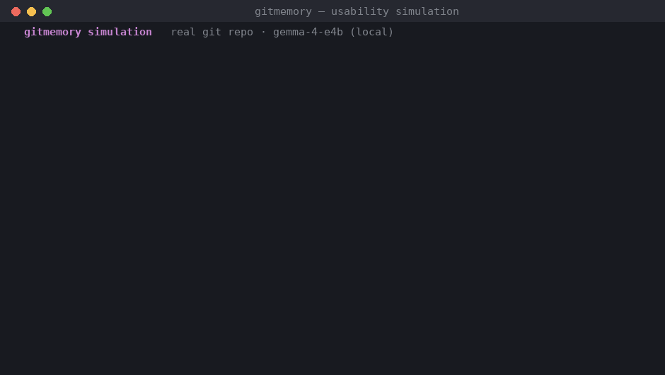

# Usability simulation

`simulate.py` proves gitmemory works end-to-end by driving a **real local git
repository** through a realistic timeline — real commits, a real memory file in
git history, and a real git merge using the union merge driver. No GitHub account
or network is required.



## Run it

```bash
python simulation/simulate.py            # uses your LM Studio model if reachable
python simulation/simulate.py --fake     # offline, deterministic (no model)
python simulation/simulate.py --keep     # keep the temp repo and print its path
```

## What each scene demonstrates

| Scene | What happens | What it proves |
| --- | --- | --- |
| 0 | Bootstrap a git repo + `install-merge-driver` | Setup is one command |
| 1 | Three PRs merge; memories are distilled & **committed** | Ingest + git-native storage |
| 2 | A new PR opens → recall posts a warning | Prevents repeating a past decision |
| 3 | That PR **reverses** the decision → supersede | The retraction lifecycle, as a git diff |
| 4 | The new PR opens again → recall updates | Stale memory never resurfaces |
| 5 | Two branches record memories → real `git merge` | Union driver resolves with **no conflict** |
| 6 | `git log` of the memory file | Memory is auditable git history |

## Inspect the result yourself

Run with `--keep`, then:

```bash
git -C <printed-path> log --oneline -- .gitmemory/memories.json
git -C <printed-path> log -p -- .gitmemory/memories.json   # see every add/supersede as a diff
```

This is the same loop the [GitHub Action](../examples/workflows/gitmemory.yml) runs
in production — recall on open, ingest + reconcile on merge.

## Live GitHub demo (optional)

`github_live_demo.py` runs the loop against a **real GitHub repo**: it creates an
issue and posts real recall + supersede comments via the REST API (recall computed
locally on your LM Studio model). This is the production behaviour without needing a
self-hosted runner.

```bash
# 1. Create a fine-grained token with Contents + Issues + Pull requests = Read/write
#    (see TOKEN_SETUP.txt), scoped ideally to a single repo.
echo 'github_pat_xxx' > ~/.gm_token && chmod 600 ~/.gm_token

# 2. Run it
python simulation/github_live_demo.py --repo <owner>/<repo>
```

The token is read only from `~/.gm_token` (never hardcoded, never committed —
`.gm_token` is git-ignored). The demo issue is labelled `[gitmemory demo]` and is
safe to delete afterwards.

